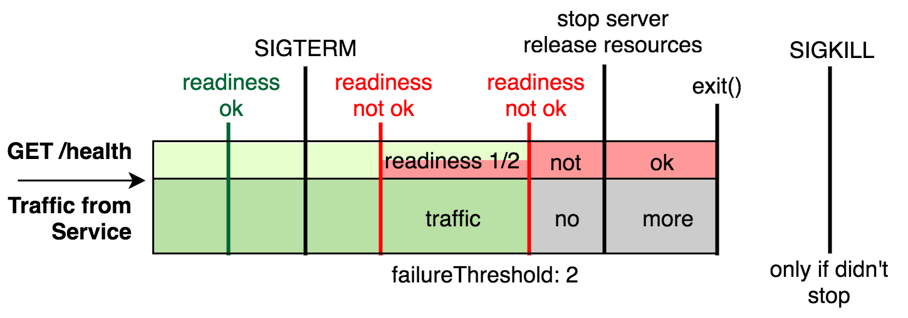

graceful-shutdown
====

## Concept

A Graceful Shutdown allows the process to finish processing pending responses and release used ressources before been killed

In Kubernetes a Service Pod can be killed any time due to scaling or any other automated/manual administration command,
the service process must be able to support the [Kubernetes Pod Lifecycle](https://kubernetes.io/docs/concepts/workloads/pods/pod-lifecycle/) by providing 2 probe routes: liveness and readiness

- `liveness` only refects that the process exists, is stable and is accessible
- `readiness` shows that the service dependencies (DB, ...) are available and is ready to process requests

While `READY` a pod will be in the service pod pool to which the traffic is directed and will receive requests to process,
on the other hand while `NOT-READY` it will leave the pool, receive no new traffic and have a grace periode to finish processing
pending responses and release used resources (DB connections, ...) before been shut down

## Features

### Multi Framework Support

The graceful shutdown logic is applied to the [net.Server](https://nodejs.org/dist/latest-v16.x/docs/api/net.html#net_class_net_server) object,
which means that all service frameworks should be supported.

### Startup Readiness Checks

Function list that is used by the readiness route to assess if start conditions are met.

### Shutdown Finalizers

Function list that has to be executed in parallel on shutdown.
As an example, you may want to push your metrics before shutdown in order to avoid metric gaps.


## Flowchart



### Liveness

a route `/health` returning a Response Status `200` and Body `OK` as soon as the service port is open

### Readiness

a route `/health/readiness` returning a Response Status `200` and Body `READY` as soon as
all service dependencies are available (DB connections, ...), `503` and `NOT-READY` otherwise

## Options

- `gracePeriodMilliseconds`: grace period in milliseconds, must be longer than the average processing time (default: 5000)
- `finalizers`: an array of functions, taking "server" and "callback" as arguments, to be executed on shutdown. 

## Knowledge

- https://blog.laputa.io/graceful-shutdown-in-kubernetes-85f1c8d586da
- https://blog.risingstack.com/graceful-shutdown-node-js-kubernetes/
- https://cloud.google.com/blog/products/containers-kubernetes/kubernetes-best-practices-terminating-with-grace
- https://expressjs.com/en/advanced/healthcheck-graceful-shutdown.html

## Usage

```javascript
const astalavista = require('@codersyndicate/graceful-shutdown');
const someDBLib = require('something'); // optional: service may have no dependencies

const options = {
    gracePeriodMilliseconds: 10000,
    finalizers: [
        function doSomethingUseful(server, callback) {
            console.log('i am dead...')
            callback();
        },
    ],
    readinessChecks: [
        function checkDBReadiness(server, callback) {
            if (ready) {
                callback();
                return;
            }
            
            callback(new Error('DB not reachable'));
        }
    ],
}

// astalavista returns a ServerGracefulShutdown instance
let graceful = astalavista.enable(server, options);

server.use('/health', graceful.liveliness);

// add a finalizer after initialisation
graceful.addFinalizer(function doSomethingEvenBetter(server, callback) {
  console.log('i shall return! (famous last words)')
  callback();
});

```

you have two possibilities to implement the readiness route

```javascript
// use existing readiness check handler
server.use('/health/readiness', graceful.readiness);

// use a custom readiness check handler
server.use('/health/readiness', (req, res) => {
    if (astalavista.isTerminated()) {
        // service has been terminated by an external signal
        // this condition is mandatory
        return res.send(503, 'NOT-READY');
    }

    graceful.checkReadiness((error) => {
        if (error !== undefined) {
            response.send(503, 'NOT-READY');
            return;
        }

        request.send(200, 'READY');
    });
});

// add a readiness check after initialisation
graceful.addReadinessCheck(function checkSomethingElse(callback) {
    console.log('does it work?')
    callback();
});

```
